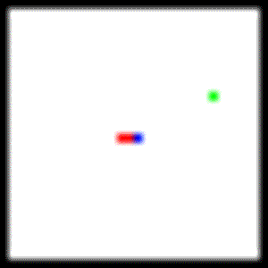

# Snake
Just a simple Snakegame. The GUI is not very elegnt, I know but I wanted to do it myself :)


# Snake with Stable Baselines 3
I think the Snake is getting more stupid after a long time of training.. but who knows. Maybe I'm not doing it right. BUT it reached 10 points, so I think it's okayish..

## AI - Old Version
The AI does work.. but not as good as I want. The biggest problem for me is to test the AI without a powerfull Graphics Card. Without the right hardware my PC needs ~1 Week to learn the basics about the game.
If I have a better Graphics Card, I will continue the project.

### Use the AI
If you want to train the AI, I recommend to copy the 'learn.py' from the ai folder to the src folder. 
```bash
cp ai/learn.py ./learn.py
```
1. Copy file from AI to source
2. Edit the learn to your needs.. or use the default.